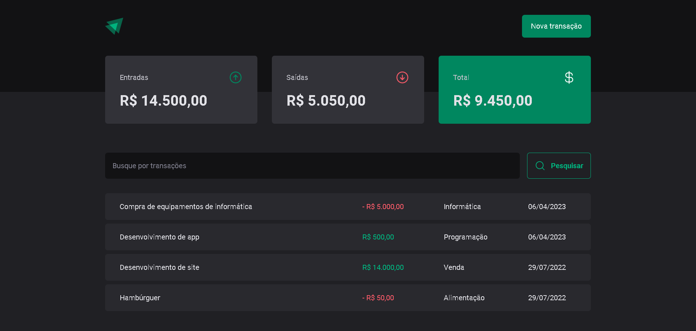
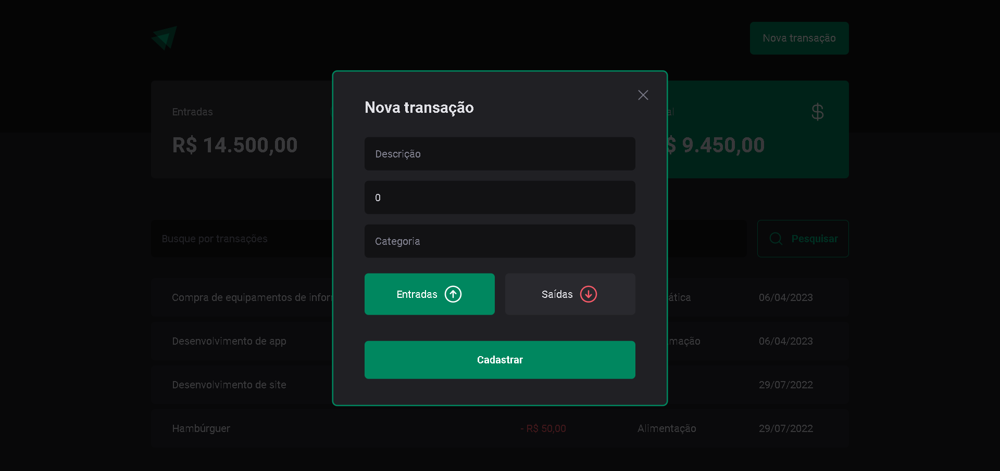

# Ignite Dt Money

<div align="center">
	
  
</div>

## :dart: Objetivo

Projeto de controle financeiro desenvolvido com o conteúdo estudado nas aulas do
Chapter III da trilha de ReactJS do Bootcamp Ignite da Rocketseat.

## :hammer_and_wrench: Ferramentas

- [axios](https://www.npmjs.com/package/axios)
- [phosphor-react](https://www.npmjs.com/package/phosphor-react)
- [react](https://pt-br.reactjs.org/)
- [react-hook-form](https://react-hook-form.com/)
- [radix-ui](https://www.radix-ui.com/)
- [styled-components](https://styled-components.com/)
- [use-context-selector](https://www.npmjs.com/package/use-context-selector)
- [typescript](https://www.typescriptlang.org/)
- [zod](https://github.com/colinhacks/zod)

## :desktop_computer: Padronização de código

- [Eslint](https://eslint.org/)
- [Prettier](https://prettier.io/)
- [EditorConfig](https://editorconfig.org/)

## :rocket: Executando o projeto

```bash
// Instale as dependências

yarn install

// Concluindo a instalação rode

yarn dev
```
